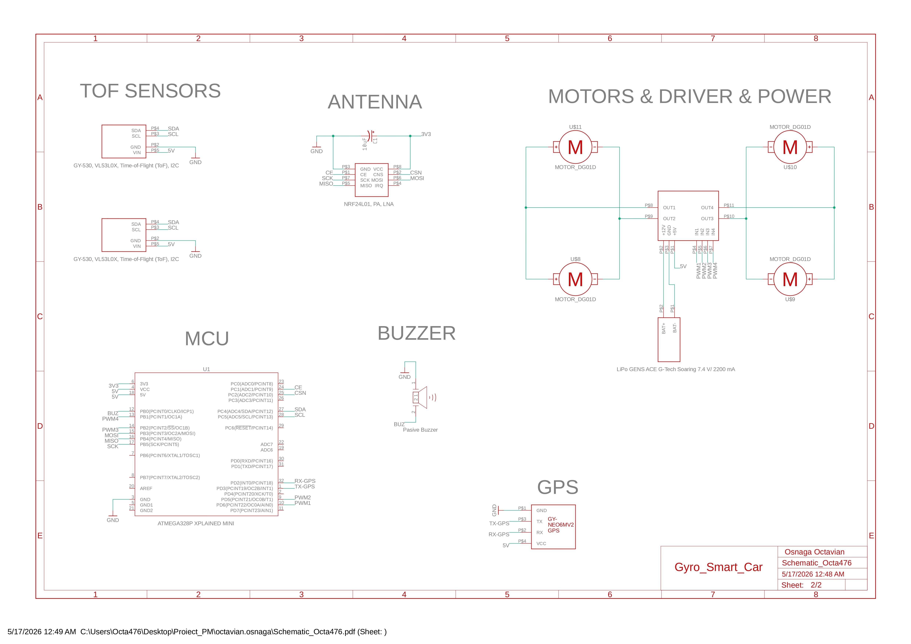
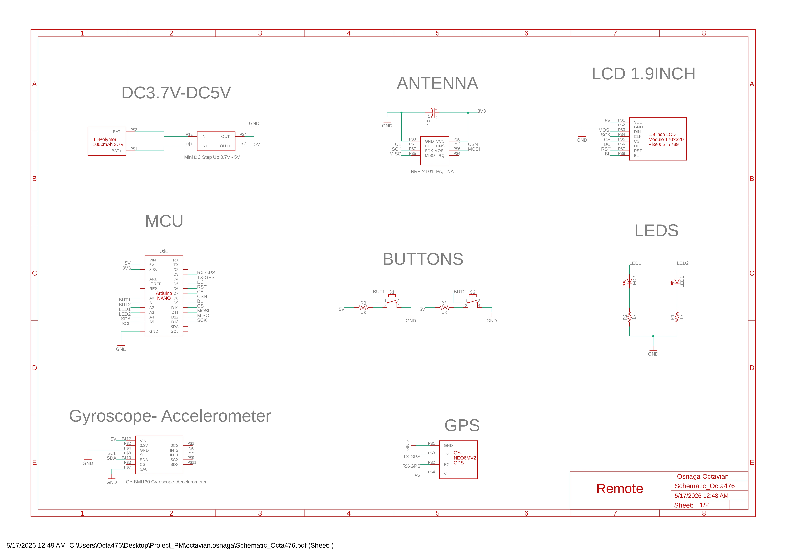
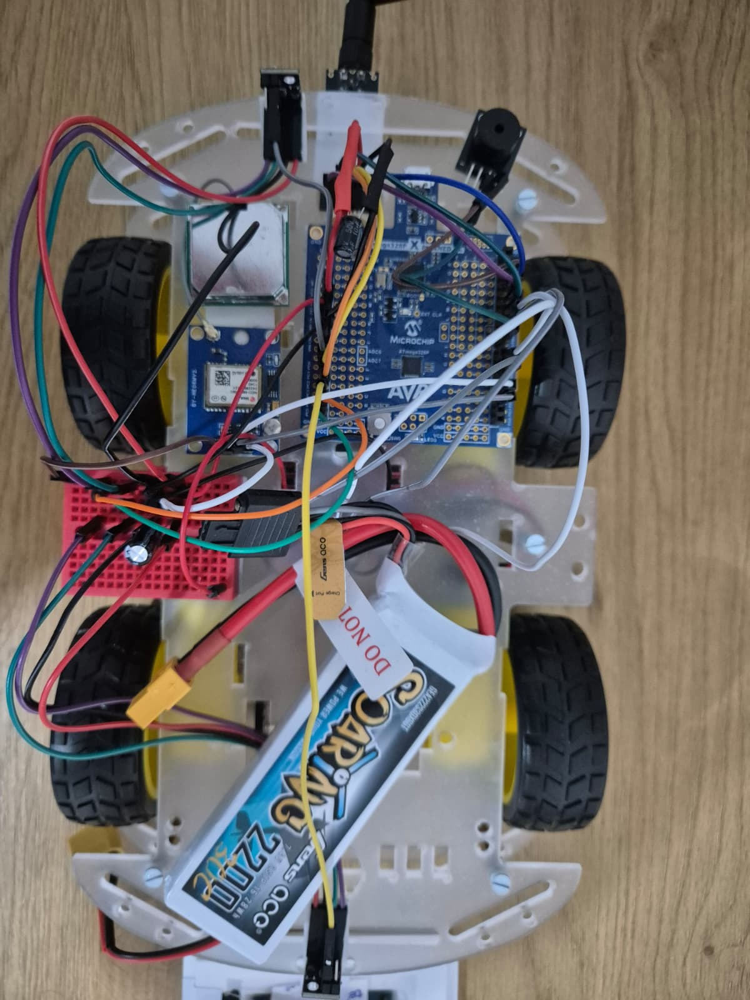
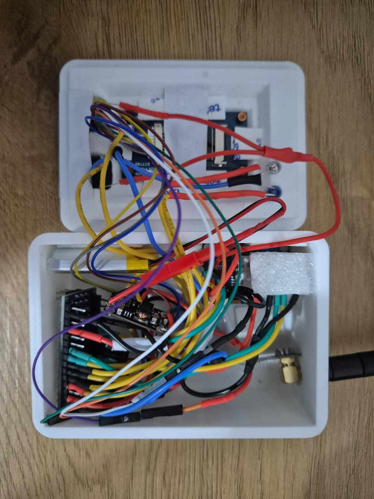
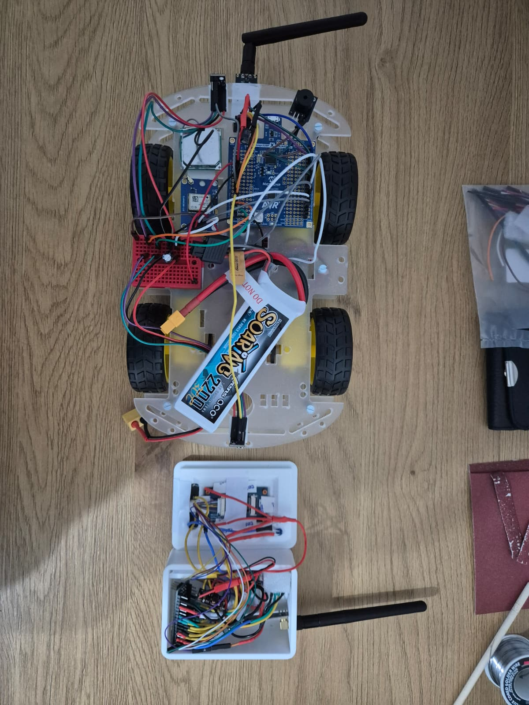

# Smart-Gyroscope-Car
PM project

## Observatii:
- explic aici in limba romana ce am de zis, comentarii si cod in limba engleza;
- nu o sa prezint pe larg ce face implementarea, aceste lucruri cred ca vor fi mentionate pe Wiki;
- consider ca acest cod este de o calitate indoielnica, dar asta am putut sa realizez in doua zile pline de aventuri;
- mentionez ca a trebuit sa desfac pinii de pe modulele de ToF, deoarece le prinsesem prost in sasiul masinii si produceau foarte multe masuratori eronate;
- am incercat sa pastrez o oarecare paradigma OOP, dar am dat gres, clasele masina si telecomanda sunt niste mini-god-objects, totusi nu suficient de complexe pentru a produce un cod greu de urmarit;
- in principal atat masina, cat si telecomanda sunt niste automate de stari ce se intitializeaza si apoi updateaza la un interval de 50ms fiecare prin updatarea fiecarui periferic; acest proces este de asemenea ajutat de mici functii asincrone implementate prin intreruperi;

## Schematic Masina

## Schematic Telecomanda

## Poze Hardware

